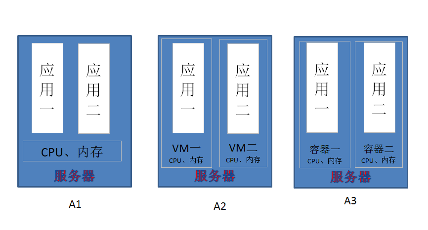

# Docker 学习/笔记

> 引用自[Docker个人学习总结](http://www.cnblogs.com/I-will-be-different/p/4353597.html) 
现在我们的模式是A1，所有的应用共享服务器的CPU、内存等资源，这时如果一个应用出现问题，比如CPU爆满等等，另一个应用也就玩完了。所以要这时就要做到资源独立，一个应用一份资源，现在要做到这样只有做成A2那样，一个服务器上装几个虚拟机，一个虚拟机一个应用。这时如果你要重启虚拟机，你想想你重启电脑要多久。而且你想迁移应用的话，你就又要装虚拟机，配环境等等，麻烦不？我是觉得麻烦。如果有了Docker，就是A3 的模式，容器是什么概念我就不说了，这时一个服务器上运行多个容器，一个容器拥有独立的CPU、内存等资源，完全满足了应用隔离的需求。而且容器重启，1秒搞定！应用迁移的时候，这个大家应该也知道，所有装了Docker的服务器，只需把镜像pull或者load进去，run，一切OK，就是这么任性！

- [完整记录在 windows7 下使用 docker 的过程](http://www.jianshu.com/p/d809971b1fc1)